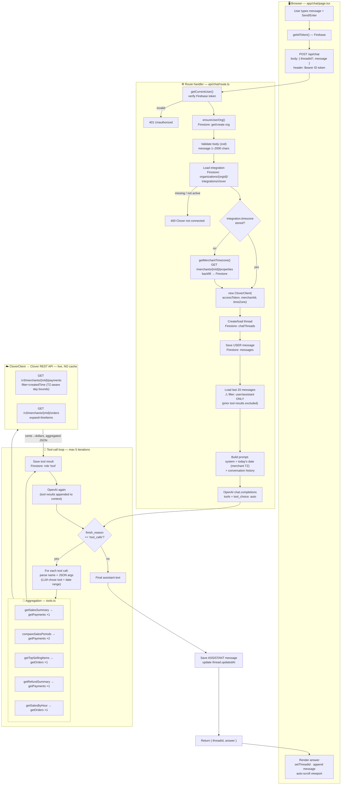
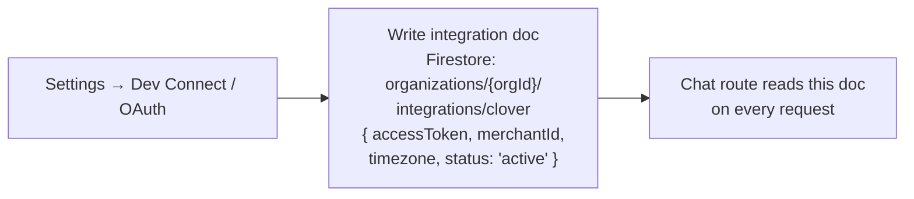

# SalesLens — Data Flow

How a chat question travels from the browser, through the AI tool loop, out to the
Clover REST API, and back — including what triggers a fresh Clover fetch and what
carries over between conversation turns.

## End-to-end flow

## What triggers a fresh fetch to Clover

- **Every tool call hits Clover live — there is no caching layer.** (`client.ts` and
  `route.ts` both carry `TODO` notes for caching/rate-limiting.)
- A single user message triggers **0 or more** Clover requests, decided by the LLM:
  - The model may answer with no tool call → **0 fetches**.
  - One tool call → 1 fetch (or **2** for `compareSalesPeriods`).
  - The loop can run up to **5 iterations**, so one message can fan out to several fetches.
- **Repeated/identical questions re-fetch every time** — nothing is memoized, not even
  the same date range asked twice in a row.
- Each distinct **(endpoint × date range)** is its own request; payments and orders are
  separate endpoints, so a question needing both (rare here) hits both.

## What relies on conversation context

- **Follow-ups work** because the last 20 `user`/`assistant` messages are replayed to
  OpenAI each turn (e.g. "what about last week?" resolves against the prior turn).
- The LLM derives **which tool** and **which date range** from that history **plus** the
  injected "today's date (merchant timezone)" in the system prompt.
- ⚠ **Prior tool results are NOT replayed.** History loading filters to `user`/`assistant`
  roles only, so raw Clover data from earlier turns isn't re-sent. Across turns the model
  relies on its **own earlier prose answers** — or it **re-fetches**. (Within a single
  turn, tool results stay in context so the model can reason over them.)

## Identity & connection prerequisites (set up once, before any chat)

- **Firebase ID token** → `user` → `org` → the **integration doc** (Clover access token +
  merchant ID + timezone). The chat route reads that doc on every request; if it's absent
  or `status !== "active"`, the request is rejected with `400` before any AI/Clover work.
